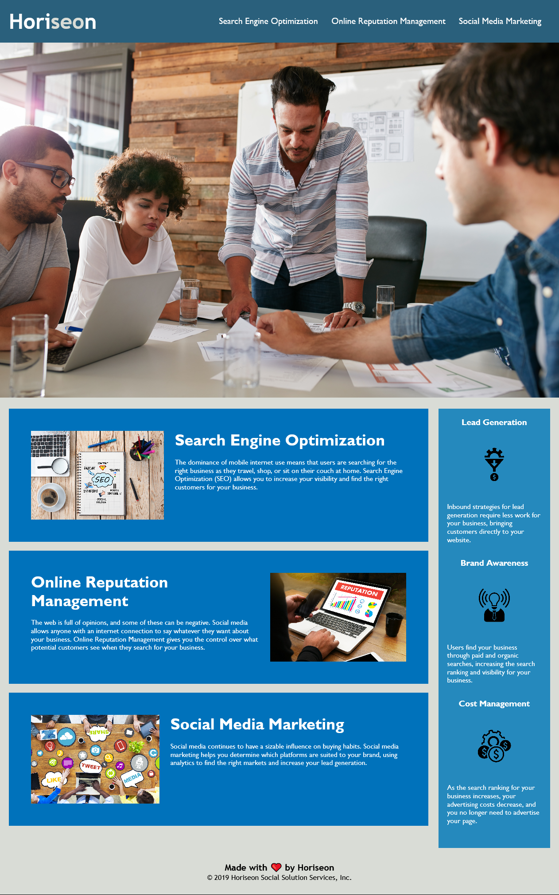

# Week 1 Homework Submission

## Goal

The goal of this assignment is to modify the website to conform to the following user story:

GIVEN a webpage meets accessibility standards  
WHEN I view the source code  
THEN I find semantic HTML elements  
WHEN I view the structure of the HTML elements
THEN I find that the elements follow a logical structure independent of styling and positioning
WHEN I view the icon and image elements
THEN I find accessible alt attributes
WHEN I view the heading attributes
THEN they fall in sequential order
WHEN I view the title element
THEN I find a concise, descriptive title

technical requirements on top of this include: 

* Application's links all function correctly.

* Application's CSS selectors and properties are consolidated and organized to follow semantic structure.

* Application's CSS file is properly commented.

## Screenshot of completed project

## Decision making 

**Semantic Elements**

The document now contains semantic sectioning instead of it's previous sole use of divs.

I went with what seemed the most appropriate, which was a section for the content area and an aside for benefits.
Benefits could be a section but it appeared to not hold as much importance as the content section.

Each div within both benefits and content were renamed to articles as they make sense in isolation.

**Image Alt attributes**

I gave the hero image and images within the content section alt attributes. The images within the benefits section were 
given blank alt attributes as they were abstract and purely decorative.

## Links

[Live Website](https://mattyd96.github.io/bootcamp-week1-homework/)
[My Github Account](https://github.com/mattyd96)